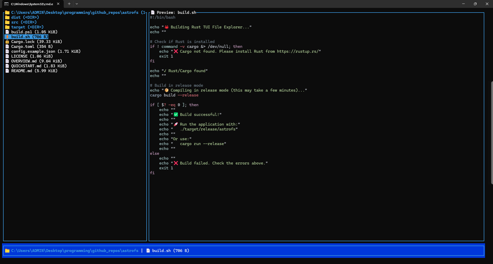
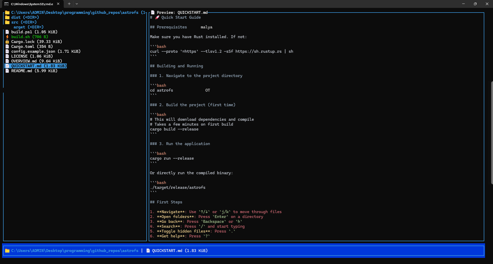
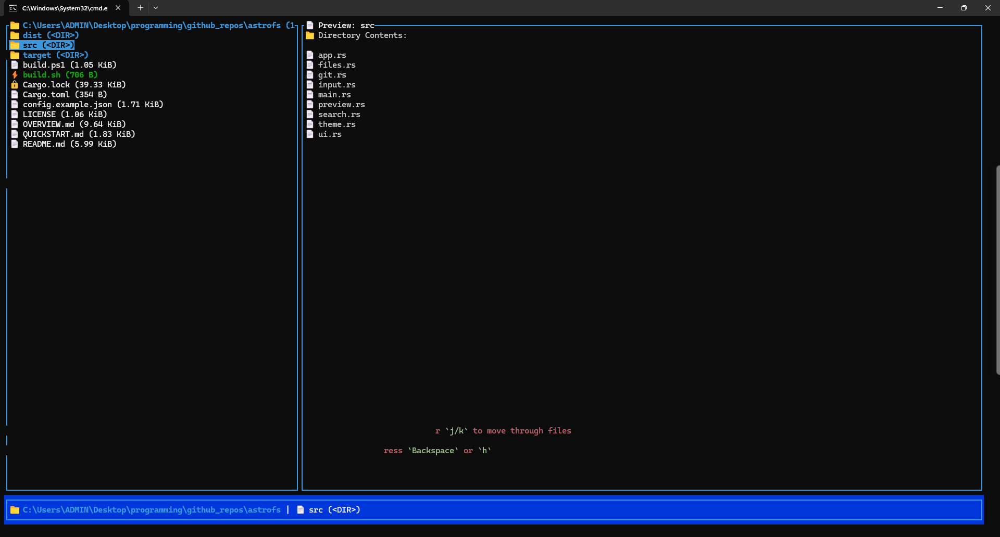
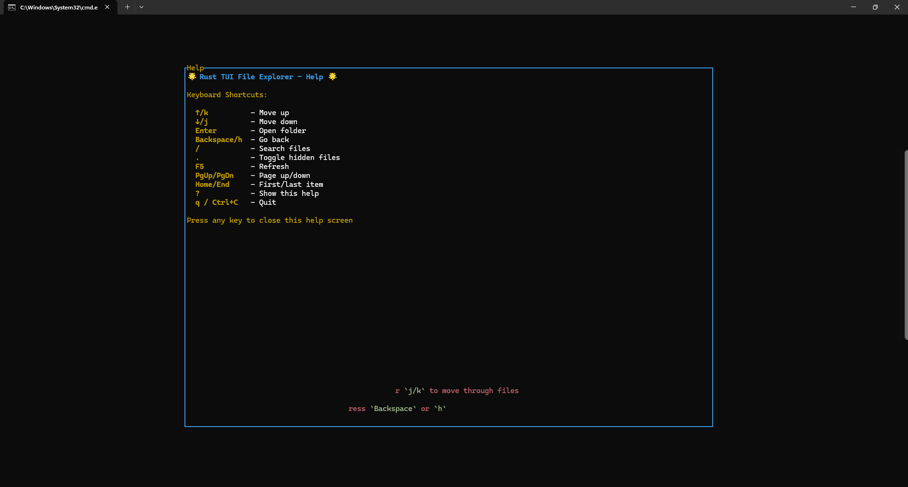

# 🌟 AstroFS

A **blazing-fast, emoji-powered, oh-my-zsh inspired terminal file explorer** built with Rust and Ratatui.


|  |  |  |  |
|---------------------------|---------------------------|---------------------------|---------------------------|

## ✨ Features

### 🎨 Beautiful UI

- **Multi-pane layout**: File tree (30%) + Preview (70%) + Status bar
- **Emoji-based file types**: 📁 Folders, 📄 Files, 🖼️ Images, ⚡ Executables, 🗜️ Archives
- **Colorful theme**: Modern aesthetic with cyan, green, magenta, yellow highlights
- **oh-my-zsh/Powerlevel10k inspired**: Git branch + dirty indicators in status bar
- **Responsive design**: Automatically adjusts to terminal size

### ⚡ Performance

- **Parallel search**: Lightning-fast file search using Rayon
- **Virtual scrolling**: Only render visible items for smooth navigation
- **Instant directory loading**: Fast directory traversal

### 🔍 Search System

- **Blazing-fast fuzzy search**: Real-time search as you type
- **Relevance scoring**: Exact match, starts-with, contains, fuzzy matching
- **Live results**: Search updates instantly
- **Parallel traversal**: Multi-threaded directory scanning

### 🛠️ Core Features

- Navigate directories with keyboard (Vim-style keys supported)
- File preview (text files, binary detection, directory listing)
- Human-readable file sizes
- Hidden file toggle (`.` key)
- Git integration (branch, dirty status)
- Page up/down navigation
- Jump to first/last item

### 🎮 Keyboard Navigation

- `↑/k` - Move up
- `↓/j` - Move down
- `Enter` - Open folder
- `Backspace/h` - Go back to parent directory
- `/` - Enter search mode
- `.` - Toggle hidden files
- `F5` - Refresh directory
- `PgUp/PgDn` - Page up/down
- `Home/End` - Jump to first/last item
- `?` - Show help
- `q` or `Ctrl+C` - Quit

## 🚀 Installation

### Prerequisites

- Rust 1.70 or higher
- Cargo

### Build from source

```bash
# Clone the repository
git clone https://github.com/pro-grammer-SD/astrofs.git
cd astrofs

# Build in release mode for best performance
cargo build --release

# Run the application
cargo run --release
```

## 📚 Usage

### Basic Navigation

1. Launch the app with `cargo run --release`
2. Use arrow keys or `j/k` to navigate
3. Press `Enter` to open a folder
4. Press `Backspace` to go back
5. Press `q` to quit

### Search Mode

1. Press `/` to enter search mode
2. Type your search query
3. Results appear in real-time with relevance scores
4. Press `Enter` to navigate to the first result
5. Press `Esc` to cancel search

### File Preview

- Text files: First 200 lines displayed
- Code files: Syntax highlighting (planned)
- Binary files: Shows "Binary file" with size
- Directories: Lists contents

## 🏗️ Architecture

```bash
src/
├── main.rs          # Application entry point + event loop
├── app.rs           # Application state and business logic
├── ui.rs            # Ratatui UI rendering and layout
├── input.rs         # Keyboard event handling
├── files.rs         # File system operations
├── preview.rs       # File preview generation
├── search.rs        # Parallel search engine
├── theme.rs         # Colors, emojis, and styling
└── git.rs           # Git integration
```

## 🎨 Customization

The color theme and emojis can be customized in `src/theme.rs`:

```rust
pub struct Theme {
    pub folder: Style,      // Folders: cyan + bold
    pub executable: Style,  // Executables: green + bold
    pub image: Style,       // Images: magenta
    pub archive: Style,     // Archives: yellow
    // ... more styles
}
```

## 🔧 Dependencies

- **ratatui** - Terminal UI framework
- **crossterm** - Cross-platform terminal manipulation
- **rayon** - Data parallelism for fast search
- **walkdir** - Recursive directory traversal
- **ignore** - Git-aware file walking
- **syntect** - Syntax highlighting (ready for future use)
- **git2** - Git repository access
- **infer** - File type detection
- **humansize** - Human-readable file sizes
- **serde + serde_json** - Configuration (ready for future use)
- **anyhow** - Error handling
- **chrono** - Date/time handling

## 🗺️ Roadmap

### Implemented ✅

- [x] Multi-pane layout with automatic resizing
- [x] File navigation (keyboard-driven)
- [x] File preview (text, binary detection, directories)
- [x] Git integration (branch, dirty status)
- [x] Fast parallel search with fuzzy matching
- [x] Emoji file type indicators
- [x] Colorful oh-my-zsh inspired theme
- [x] Hidden file toggle
- [x] Status bar with Git info and file details
- [x] Page up/down navigation
- [x] Jump to first/last item
- [x] Help screen
- [x] Syntax highlighting in file preview

### Planned Features 📋

- [ ] File operations (copy, move, delete, rename)
- [ ] Create new folders/files
- [ ] Archive file preview (ZIP, TAR contents)
- [ ] Image metadata display
- [ ] Open files with default applications
- [ ] Tab support (multi-pane workspaces)
- [ ] Configurable themes (load from JSON)
- [ ] Bookmarks for quick directory access
- [ ] Search history
- [ ] Command palette
- [ ] Plugin system

## 🤝 Contributing

Contributions are welcome! Please feel free to submit a Pull Request.

1. Fork the repository
2. Create your feature branch (`git checkout -b feature/amazing-feature`)
3. Commit your changes (`git commit -m 'Add some amazing feature'`)
4. Push to the branch (`git push origin feature/amazing-feature`)
5. Open a Pull Request

## 📝 License

This project is licensed under the MIT License - see the LICENSE file for details.

## 🙏 Acknowledgments

- [Ratatui](https://github.com/ratatui-org/ratatui) - Amazing TUI framework
- [oh-my-zsh](https://ohmyz.sh/) - Inspiration for the aesthetic
- [Powerlevel10k](https://github.com/romkatv/powerlevel10k) - Status bar inspiration

## 💡 Inspiration

This project was inspired by modern terminal tools like:

- **lf**: Terminal file manager
- **ranger**: Console file manager with VI key bindings
- **nnn**: Blazing-fast terminal file manager
- **broot**: Tree view file explorer

---

Made with ❤️ and 🦀 Rust
